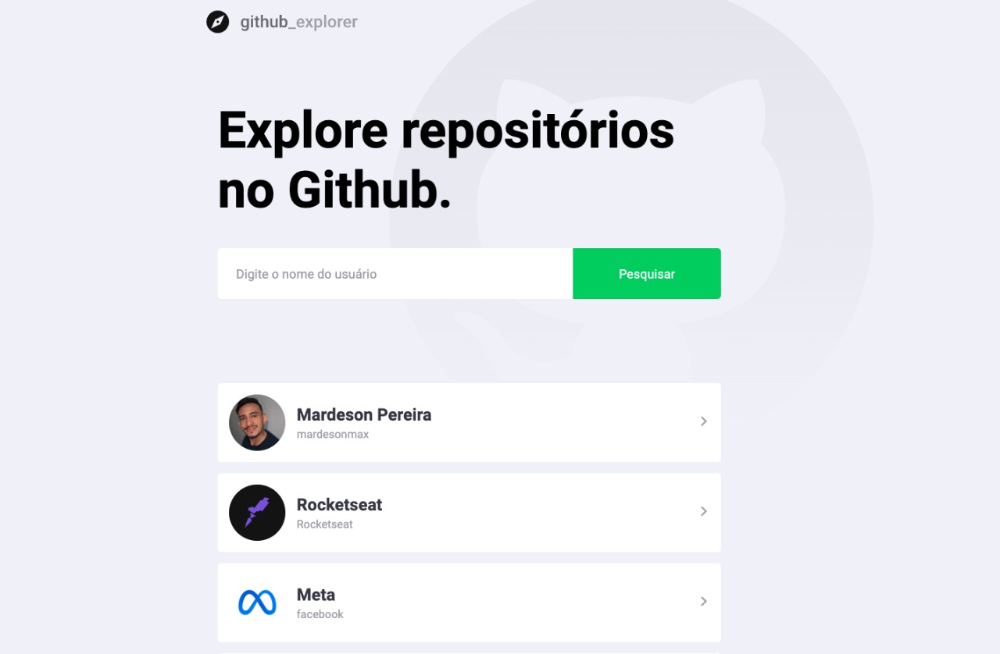

<div align="center">
  <a
    href="https://github-explore-navy.vercel.app/"
    target="_blank"
    rel="noopener noreferrer"
  >
    
  </a>

  <br />
  <br />
  <br />
</div>

# Índice

- [Índice](#índice)
- [Sobre](#sobre)
- [Tecnologias Utilizadas](#tecnologias-utilizadas)
- [Requerimentos](#requerimentos)
  - [Necessidades para executar](#necessidades-para-executar)
  - [Como executar?](#como-executar)
    - [Clonar](#clonar)
    - [Criar arquivo de configurações](#criar-arquivo-de-configurações)
    - [Instalar os pacotes](#instalar-os-pacotes)
    - [Executando o projeto](#executando-o-projeto)
- [Licença](#licença)

# Sobre

Aplicação desenvolvida para pesquisas de usuários do Github, obtendo algumas informações de seu perfil, assim como seus repositórios.

# Tecnologias Utilizadas

Todo o projeto está sendo desenvolvido em um ambiente **Node**, utilizando uma versão **LTS** e sistema operacional MacOS Monteray

- [TypeScript](https://www.typescriptlang.org/)
- [Node.js](https://nodejs.org/)
- [React](https://pt-br.reactjs.org/)
- [Yarn](https://yarnpkg.com/)

# Requerimentos

É necessário uma IDE para desenvolver, utilizo e recomendo o uso do [Visual Studio Code](https://code.visualstudio.com/)

## Necessidades para executar

- Node.js
- Yarn

## Como executar?

Para executar, siga as etapas a seguir:

### Clonar

Clone o projeto utilizando o código a seguir ou [baixe diretamente](https://github.com/mardesonmax/github-explore/archive/refs/heads/main.zip)

```sh
# https
git clone https://github.com/mardesonmax/github-explore.git

# ssh
git clone git@github.com:mardesonmax/github-explore.git
```

### Criar arquivo de configurações

Execute o comando a seguir ou duplique o arquivo `.env.example` renomeando para `.env`.

```sh
cp .env.example .env
```

Agora abra o aquivo `.env` para editar as seguinte linha:

- **REACT_APP_GITHUB_ACCESS_TOKEN**, [Acesse aqui](https://docs.github.com/pt/authentication/keeping-your-account-and-data-secure/creating-a-personal-access-token) para obter a key

### Instalando os pacotes

Execute o comando a seguir para instalar os pacotes:

```sh
yarn install
```

### Executando o projeto

Execute o comando a seguir para inicializar o projeto:

```sh
yarn start
```

Após executar o comando a seguinte página será aberta no seu navegador:
[localhost:3000](http://localhost:3000)

# Licença

Esse projeto está sob a [licença](./license.md) do MIT.
